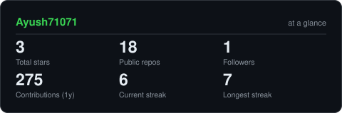
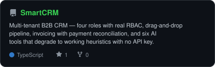
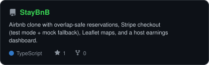
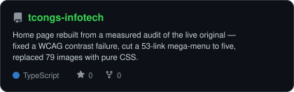
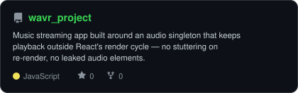

<div align="center">

<!-- PORTRAIT - generated by scripts/dotify.py from assets/me.png, true photo
     colours. A dark backdrop (#0d1117, GitHub's own dark-mode background) is
     baked into the SVG with --bg so it reads the same everywhere instead of
     depending on the viewer's theme -- this source photo is bright/evenly
     lit enough that a transparent version washed out on the light theme.
     Regenerate with:
       python scripts/dotify.py assets/me.png -o assets/portrait \
         --cols 100 --equalize --detail 0.5 --color --bg "#0d1117" -->


<br>

<!-- NAME / TAGLINE - animated typing -->
<a href="https://github.com/Ayush71071">
  
</a>

<br>

<!-- SOCIALS -->
<a href="https://www.linkedin.com/in/ayush-prabhavale-67b2052b4/"></a>
<a href="mailto:YOUR_EMAIL_HERE"></a>
<a href="https://smartcrm-sooty.vercel.app"></a>


</div>

---

## `~/` whoami

```console
$ cat about.txt
```

**Full-stack engineer — TypeScript, Next.js, Node, PostgreSQL.** CSE @ VIT (2028), based in Pune.

I build applications that are actually finished: auth, multi-tenancy, permissions, payments, seed
data, and a live URL you can click. Currently open to **full-stack / backend internships (2026–27
cycle)**.

<br>

<div align="center">

## `~/` toolbox


`TypeScript` `JavaScript` `Java` `React 19` `Next.js 15 (App Router)` `Node.js` `Redux Toolkit` `Tailwind CSS` `Framer Motion` `Prisma` `PostgreSQL` `Auth.js` `Zod` `TanStack Query` `Stripe` `Docker` `Git`

</div>

---

<div align="center">

## `~/` skill radar

<table>
<tr>
<td width="50%" align="center" valign="middle">

<!-- Self-rated radar - edit assets/skills.json, the workflow redraws it -->
<picture>
  <source media="(prefers-color-scheme: dark)"  srcset="assets/radar-dark.svg">
  <source media="(prefers-color-scheme: light)" srcset="assets/radar-light.svg">
  
</picture>

</td>
<td width="50%" align="center" valign="middle">

<!-- Live radar built from real language byte counts across your repos -->
<picture>
  <source media="(prefers-color-scheme: dark)"  srcset="assets/radar-langs-dark.svg">
  <source media="(prefers-color-scheme: light)" srcset="assets/radar-langs-light.svg">
  
</picture>

</td>
</tr>
</table>

</div>

---

<div align="center">

## `~/` contribution calendar

<!-- 3D isometric calendar, regenerated every 6h by .github/workflows/metrics.yml -->


<br><br>

<!-- Snake eats the contribution graph - .github/workflows/snake.yml -->
<picture>
  <source media="(prefers-color-scheme: dark)"  srcset="https://raw.githubusercontent.com/Ayush71071/Ayush71071/output/snake-dark.svg">
  <source media="(prefers-color-scheme: light)" srcset="https://raw.githubusercontent.com/Ayush71071/Ayush71071/output/snake.svg">
  
</picture>

</div>

---

<div align="center">

## `~/` the numbers

<!-- Generated by scripts/cards.py into this repo. Deliberately NOT
     github-readme-stats / streak-stats / github-profile-trophy: those are
     shared public instances that go down and take the whole section with them. -->
<picture>
  <source media="(prefers-color-scheme: dark)"  srcset="assets/card-stats-dark.svg">
  <source media="(prefers-color-scheme: light)" srcset="assets/card-stats-light.svg">
  
</picture>

<br>


<br><br>


</div>

---

<div align="center">

## `~/` what I've shipped

<!-- Cards generated by scripts/cards.py from assets/projects.json.
     Stars, forks and language are pulled live from the API on every run. -->
<table>
<tr>
<td width="50%">
  <a href="https://github.com/Ayush71071/SmartCRM">
    <picture>
      <source media="(prefers-color-scheme: dark)"  srcset="assets/card-SmartCRM-dark.svg">
      <source media="(prefers-color-scheme: light)" srcset="assets/card-SmartCRM-light.svg">
      
    </picture>
  </a>
</td>
<td width="50%">
  <a href="https://github.com/Ayush71071/StayBnB">
    <picture>
      <source media="(prefers-color-scheme: dark)"  srcset="assets/card-StayBnB-dark.svg">
      <source media="(prefers-color-scheme: light)" srcset="assets/card-StayBnB-light.svg">
      
    </picture>
  </a>
</td>
</tr>
<tr>
<td width="50%">
  <a href="https://github.com/Ayush71071/tcongs-infotech">
    <picture>
      <source media="(prefers-color-scheme: dark)"  srcset="assets/card-tcongs-infotech-dark.svg">
      <source media="(prefers-color-scheme: light)" srcset="assets/card-tcongs-infotech-light.svg">
      
    </picture>
  </a>
</td>
<td width="50%">
  <a href="https://github.com/Ayush71071/wavr_project">
    <picture>
      <source media="(prefers-color-scheme: dark)"  srcset="assets/card-wavr_project-dark.svg">
      <source media="(prefers-color-scheme: light)" srcset="assets/card-wavr_project-light.svg">
      
    </picture>
  </a>
</td>
</tr>
</table>

<sub>

| Project | What it is | Stack | Live |
| --- | --- | --- | --- |
| **[SmartCRM](https://github.com/Ayush71071/SmartCRM)** | Multi-tenant B2B CRM — organisations, four roles with real RBAC, drag-and-drop pipeline, invoicing with payment reconciliation, and six AI tools that degrade to working heuristics with no API key | Next.js 15 · TypeScript · Prisma · Postgres · Auth.js · OpenAI | [Demo](https://smartcrm-sooty.vercel.app) |
| **[StayBnB](https://github.com/Ayush71071/StayBnB)** | Airbnb clone with overlap-safe reservations, Stripe checkout (test mode + mock fallback), Leaflet maps, and a host earnings dashboard | Next.js 15 · TypeScript · Prisma · Postgres · Stripe | [Demo](https://stay-bn-b-opal.vercel.app) |
| **[Tcongs Infotech redesign](https://github.com/Ayush71071/tcongs-infotech)** | Home page rebuilt from a measured audit of the live original — fixed a WCAG contrast failure, cut a 53-link mega-menu to five, replaced 79 images with pure CSS | Next.js 14 · TypeScript · Tailwind · Framer Motion | [Demo](https://tcongs-infotech-taupe.vercel.app) |
| **[WAVR](https://github.com/Ayush71071/wavr_project)** | Music streaming app built around an audio singleton that keeps playback outside React's render cycle — no stuttering on re-render, no leaked audio elements | React 18 · Redux Toolkit · HTML5 Audio | [Demo](https://wavr-project.vercel.app) |
| **[MONOLITH](https://github.com/Ayush71071/e_commerce-website)** | Client-side e-commerce SPA: filtering, sorting, cart drawer, four-step checkout wizard. No backend, no build step | React 18 · JavaScript · CSS | — |

</sub>

</div>

---

### How I work

- **Ship the boring parts.** Password reset, invitation flows, audit logs, and pagination are what separate a demo from a product. My projects have them.
- **Degrade gracefully.** Every external dependency in SmartCRM — AI, email, file storage — has a working fallback, so the app runs end to end with a single environment variable set.
- **Measure before redesigning.** The Tcongs redesign started by reading the live site's computed styles, not by looking at it — that is how the illegible CTA buttons turned up.
- **Write down the limits.** Each README has a known-limitations section. I would rather tell you what is missing than have you find it.

### Also here

- **[LEETCODE](https://github.com/Ayush71071/LEETCODE)** — LeetCode solutions, synced from LeetHub.
- **[CCRM](https://github.com/Ayush71071/CCRM)** — Campus Course & Records Manager in Java SE: OOP, NIO.2, Streams, Singleton and Builder.
- **[tcongsinfotech](https://github.com/tcongsinfotech)** — commits on a live e-commerce web app and its React Native client.

---

<div align="center">

<sub>First, solve the problem. Then, write the code.</sub>

</div>
